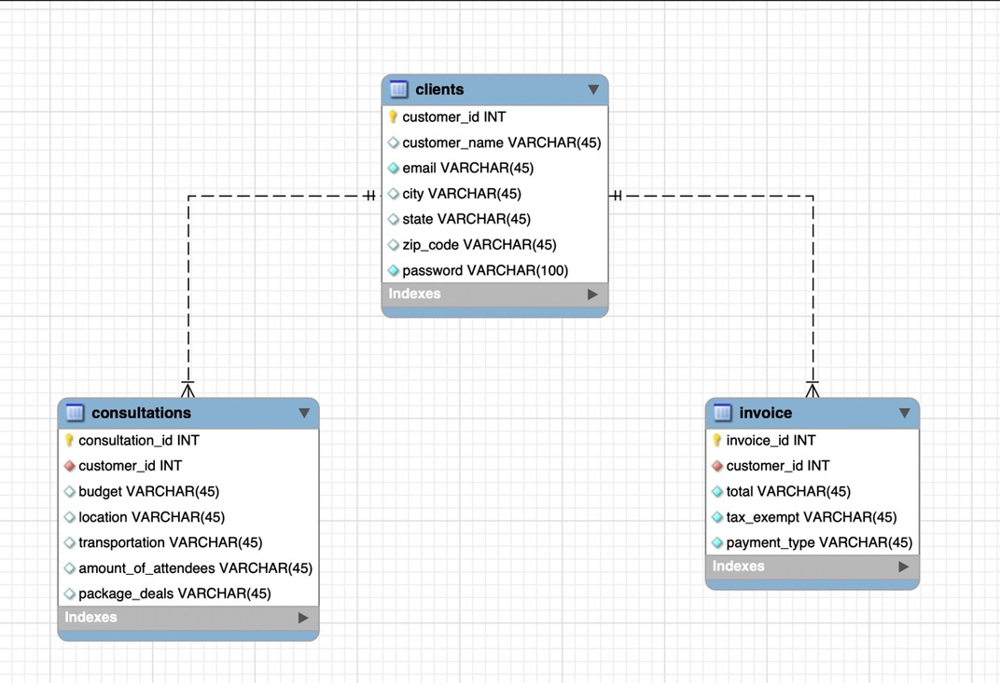

# Capstone-Project

My Project consist of a Travel Guide page where clients will be able to book travel consultations for their next destination with the option of choosing one of three travel packages the company offers. 

# Data Needs

+ Step one: Created AWS database (Capstonedb) and set up the configuration

+ Step two: Linked the AWS database to mySQL workbench and got it up and running.

+ Step three: ER Diagram

 

----- Clients, Consulation and the service invoice will be seperated into tables with the adequate information to identify the clients information, what the consultation consisted of, if the client arranged for a package deal, and the inclusion of the invoice information. -----

DATA RELATION : initially the client will input their information in the client table where he will log in and create an account with the company which will include an email and password for security. 

From there the infomartion will be saved in order to begin work on the consultation which will identify what the clients goals are for their destination;What is the clients budget?, where they want to travel?, what sort of transportation will fit their needs? are all questions that will be used to help the client.  

Finally, the invoice table will allow the service provider to go ahead and get a tally of the work provided for the customer in order to present them with a proper receipt after their payment. Things to consider is what was included in the consultation, did the client apply for a package deal (budget, standard,luxury), and is the client a returning customer. Note that a returning customer may ask for several services and in turn some tables will have multiple interactions with the others. 

Step four: Data

Clients Table
|customer_id (PK)| 1|
|-----|------|
|customer_name| Cesar
|email | Cesar@gmail.com |
|city| Lubbock|
|state| TX|
|zip_code| 7654|
|password| 1234|

Consultations Table
|consultations_id (PK)| 1|
|-----|------|
|customer_id (FK) | 1|
|budget| $5,500 |
|location| Denver|
|transportation| CO|
|amount_of_attendees| 4|
|package_deal| none|

Invoice Table
|invoice_id (PK)| 1|
|-----|------|
|customer_id (FK) | 1|
|total | $500.00|
|tax_exempt| no|
|payment_type| card |

SeedData.sequel is the sql command that will go ahead and provide the API with tables named after the data. 

Controllers:

    getAllClients
    getClientById
    createClient
    updateClientById
    deleteClientByName

Routers:

router.get('/', usersController.getAllClients)

router.get('/:id', usersController.getClientById)

router.post('/', usersController.createClient)

router.put('/:id', usersController.updateClientById)

router.delete('/:Client', usersController.deleteClientByName)

